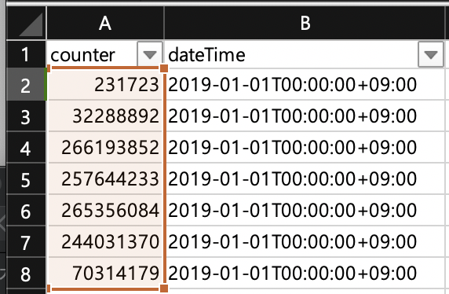

# Network Throughput 최대 값 추출하기

## 1. Intro


목적 : 

1. IBM Cloud Portal에서 개별 서버 그래프로만 제공하는 가상서버/베어메탈의 Network Throughput을 엑셀 파일로 최대 값 추출하기 


## 2. Pre-Requisite

1. Python, pip 설치 : slcli 설치 및 python 스크립트 실행을 위함
2. IBM Cloud CLI 설치 : Softlayer Credential 얻기 위함
3. NVM, Node, npm 설치 : JSON 2 CSV로 변한 작업을 위함

   1. Python 코딩 또는 인터넷 무료 사이트 사용 가능

   > Link : http://www.convertcsv.com/json-to-csv.htm

### 2.1 python, pip 설치 

파이썬 공식 사이트에 접속하여, python 및 pip를 설치합니다.

Python : [https://www.python.org/downloads/](https://www.python.org/downloads/)

pip : [https://packaging.python.org/tutorials/installing-packages/](https://packaging.python.org/tutorials/installing-packages/)


**Python 2.7.9 \(or greater\)** 또는 **Python 3.4 \(or greater\)**  경우 pip가 포함되어 있음


아래 명령어를 통해 정상적으로 설치 되었는지 확인한다.

```bash
$python -V
Python 2.7.10
$pip -V
pip 18.1
```

### 2.2 IBM Cloud CLI 설치 

```bash
$pip install softlayer
```

다른 환경 설치 방법 : [https://softlayer-api-python-client.readthedocs.io/en/latest/install/](https://softlayer-api-python-client.readthedocs.io/en/latest/install/)

#### 2.2.1 SLCLI 계정 설정

계정을 설정하기 위해, IBM ID 값과 API Key를 확인해보자  
control.softlayer.com에 접속하여 우측 상단의 이름\(빨간박스\)를 클릭한다.


계정 세부 설정 페이지가 나오면, 하단 부분의 API 접근 정보를 참고하여 진행한다.


아래 softlayer cli setup 명령어를 실행시킨다. 만약 여기서 오류가 난다면 2.2의 softlayer가 정상적으로 설치되지 않은 것이다.

```bash
$slcli setup
```

control.softlayer.com에 접속하여 계정 ID 및 API 입력한다.   
기타 설정 항목은 enter를 눌러 default 값으로 설정해 준다.

```bash
Username [IBMxxxxxxx] : ID 값
API Key or Password [xxxx...xxxx] : API 키 값 
Endpoint (public|private|custom) [public]:
Timeout [0]:
```


SSL VPN을 통해 SLCLI를 사용하고자 한다면, private end point로 설정해주자!


### 2.3 NVM, Node, NPM 설치

아래 Github 페이지에서 NVM을 설치한 후, Node와 NPM을 설치해주자! 

Link : [https://github.com/creationix/nvm\#install-script](https://github.com/creationix/nvm#install-script)


$source .bash\_profile 명령어를 통해 CLI Command 등록해야한다!


원하는 Node 버전을 설치하고 사용하도록 한다. 버전이 정확히 뜨면 정상적으로 설치가 된 것이다.

```bash
$nvm install v9.4.0
$nvm use v9.4.0
$nodejs -v
$npm -v
```

## 3. 서버 자원 목록 가져오기 

가상서버, 베어메탈 서버 리스트를 slcli 통해 가져와, csv 파일로 추출한다.

```bash
$slcli vs list > vs.csv
# vs - virtual server
$slcli hw list > hw.csv
# hw - baremetal server
```

추출 된 파일을 열어 엑셀의 데이터 분할 기능을 통해 항목 별로 분리하고, 서버 ID 열을 제외하고 전부 삭제한다.


## 4. Network Throughput 추출하기 

Python 스크립트를 실행시켜 Network Throughput 정보를 가져온다.  
앞에서 생성한 vs.csv 파일과 아래 조건으로 인해 서버가 많으면 시간이 꽤 걸린다...


getVM\_NW\_PublicIn.py 조건 : 

* Server Type : 가상서버
* Public Network Inbound Interface
* Metric Type : Max\(평균, 합계도 가능\)
* 1달 기준\(2019-01-01 ~ 2019-01-31\)
* 10분 단위 측정\(unit : 600\)
* Input file : vs.csv


```bash
$python getVM_NW_PublicIn.py > maxVM_month_out_result.json
```



```python
import SoftLayer
from pprint import pprint as pp
import csv

class example():

    def __init__(self):
        self.client = SoftLayer.Client()

    def main(self, tracking_id):

        tracking_service = self.client['SoftLayer_Metric_Tracking_Object']
        #bw_result = tracking_service.getBandwidthData('2019-01-30', '2019-01-31', 'public', 600, #id=tracking_id)
        
        object_type = [{'keyName':'PUBLICIN_NET_OCTET','summaryType':'max','name':'publicIn_net_octet'}]
        summary_result = tracking_service.getSummaryData('2019-01-01','2019-01-31', object_type, 600, id=tracking_id)
        
        # In CPU case:
        # KeyName : CPU0,CPU1,...,CPUn
        # Name : cpu
        # summaryType: average/max/sum
        # In Memory case: KeyName : MEMORY_USAGE
        # Name : memory_usage
        # summaryType: average/max/sum
        # In Network case:
        # KeyName : PUBLICIN_NET_OCTET/PUBLICOUT_NET_OCTET/PRIVATEIN_NET_OCTET/PRIVATEOUT_NET_OCTET
        # Name : publicIn_net_octet/publicOut_net_octet/privateIn_net_octet/privateOut_net_octet
        # summaryType: average/max/sum
        
        #args = {
        #    'startDateTime' : '2019-01-01',
        #    'endDateTime':'2019-01-31',
        #    'metrics': #[{'keyName':'PUBLICOUT_NET_OCTET','summaryType':'max','name':'publicOut_net_octet'}],
        #    'interval':600,
        #    'returnImage': False
        #}
        #custom_result = tracking_service.getCustomGraphData(args,id=tracking_id)
        pp(summary_result)

    # For use with a virtual Guest, just change
    # SoftLayer_Hardware_Server here with SoftLayer_Virtual_Guest
    def getTrackingId(self, server_id):
        tracking_id = self.client['SoftLayer_Virtual_Guest'].getMetricTrackingObjectId(id=server_id)
        return tracking_id

if __name__ == "__main__":
    main = example()
    
    f = open('vs.csv', 'r')
    rdr = csv.reader(f)
    a=0
    for line in rdr:
        my_server_id = line[0]
        tracking_id = main.getTrackingId(my_server_id)
        main.main(tracking_id)
        a+=1
    print(a)
    # CHANGE THIS
    #my_server_id = 50122710
    #tracking_id = main.getTrackingId(my_server_id)
    #main.main(tracking_id)
```



그 외의 조건\(베어메탈, public in, average 등\)을 작성한 Script는 아래 항목을 참고하기 바란다.



JSON 파일이 생성되면, 정규 JSON 문법에 맞게 '\(홀따옴표\)를 "\(쌍따옴표\)로 변경해준다.  
텍스트 에디터의 텍스트 대치 기능을 사용하여 바꾸자.

\[{"counter": 852.0,   
  "dateTime": "2019-01-01T00:10:00+09:00",   
  "type": "publicIn\_net\_octet"} ....

## 5. JSON 2 CSV 변경하기

Node로 작성된 json2csv git 레파지토리를 복제해와 global 옵션으로 설치한다.  
위에서 추출한 JSON은 counter, dateTime, type의 항목을 가지고 있다.  
따라서  -i : input file, -f : 항목, -o : output file 변수 값을 설정하여 csv로 converting 한다.

```bash
$git clone https://github.com/honginpyo1/json2csv
$npm install -g json2csv
$json2csv -i maxVM_month_out_result.json -f counter,dateTime,type -o maxVM_month_out_result.csv
```

## 6. 엑셀 작업으로 Max 값 뽑아내기

변환 된 csv 파일을 확인해 보면 아래와 같이 변환되어 있다.


1 행의 항목 값들에 엑셀 필터를 적용하여, dateTime을 오름차순으로 정렬한다.  
그러면 동일한 시간\(10분단위\)으로 모든 서버 값들이 정렬이 된다.

정렬이 완료 되면, 단위 시간 만큼의 counter 값을 모두 더한다.

```text
=SUM(A2:A8)
```

아래의 예시 경우, 서버 7대에 대해 추출하였기 때문에, A2:A8까지 합쳐서 E열 2행에 값을 구한다.



현재 추출 된 값들은 모두 bits per sec 임으로 숫자가 너무 크다. gbps\(giga bits per sec\)으로 변경해주자.



데이터가 너무 많아 수식을 적용하기 어려울 때는, 가장 아래 값\(ctrl + 아래 방향키\)으로 이동한 후, E2, F2, G2, H2 값을 복사 한 후 붙여 넣기 해주자.  
그리고 shift+ctrl+위에 방향키를 통해 가장 아래 값부터 위에 값까지 영역을 모두 선택한 후, ctrl + D 명령어를 통해 수식을 모두 적용 할 수 있다.


여기서 들 수 있는 의문점은, E2의 수식대로 전부 적용하면 중복 값들이 계속 생긴다는 점이다.  
예를 들어, E2 : A2 ~ A8의 합, E3 : A3 ~ A9의 합 =&gt; A3부터 A8까지 중복 값이 생긴다.

따라서 중복 값은 제외하기 위해, 단위시간 당 하나의 값만 가져와야 한다. 즉, E2와 같이 단위 시간의 첫번째 값부터 마지막 값을 합산하는 행들의 값만 가져와야 한다.

```text
=VALUE(OFFSET($H$2,(ROW(A2)-1)*7,))
```

수식이 조금 복잡하지만, 사실 간단하다.  
- Value는 text를 숫자로 변환시켜 주는 기능이다.   
- Offset은 기준셀, 행 이동 칸수, 열 이동 칸수로 구성 된다. 위의 수식에선 H2 값을 기준\(포함하여\)으로 7개 행마다의 값을 가져온다.\(Row\(A2\)의 값은 2\(행\)에 -1 \* 7을 하여 7개 행 단위로 건너 뛴다.\)

따라서 위의 수식을 쭉 복사하여 0이 나올때까지 복붙한다. 그러면 아래와 같이 단위 시간\(10분, 7개 행\)마다 계산된 값을 가져온다.


10분 단위 합산 결과 값 중 가장 큰 값을 '마지막' 으로 추출하기 위해 Max 함수를 사용한다.

```text
=MAX(J2:J5000)
#J5000 값은 임의로 지정하였다. 1달 기준, 10분 단위로 하면 저 범위 안에 모두 포함된다.
#1달은 2,592,000초 600초(10분)으로 나누면 4,320개의 단위 시간이 나온다. 
```

그러면 아래와 같이 한달 중에 Network Throughput에 대한 피크 치\(Max 값\)를 구할 수 있다.



서버 대상을 변경하려면, vs.csv/bm.csv 파일의 서버 id를 조절하면된다.

조건을 변경하려면, Python 스크립트를 변경하면 되며 조건 변수\(Public\_Out 등과 같은\)는 Python 스크립트에 주석으로 작성하였다.


